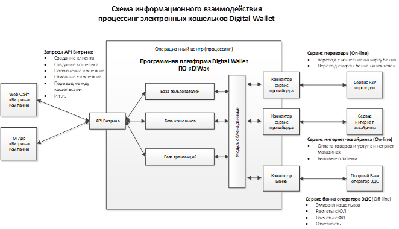

# Введение

Программная платформа Digital Wallet (ПО «DiWa») – это программное обеспечение для построения систем процессинга электронных кошельков, используя которое заинтересованная компания сможет предоставить своим Клиентам полный комплекс современных высокотехнологичных услуг по проведению операций с электронными кошельками (электронными денежными средствами с использованием электронными средствами платежа) с помощью мобильного телефона и через Интернет. Пользователи процессинговой системы «DiWa» смогут управлять своими средствами на электронных кошельках, совершать платежные операции по оплате товаров и услуг в торгово-сервисных предприятиях, а также и переводы другим пользователям кошельков или банковских карт через web-интерфейс, мобильное приложение на телефоне и другими дистанционными способами круглосуточно, в удобное для них время.

Отличительной особенностью ПО «DiWa» является наличие готовых интерфейсов для подключения к компаниям – сервис-провайдерам электронной коммерции и электронных переводов, что позволяет компании в короткий срок предоставить клиентам различные каналы пополнения кошельков и использования средств с кошельков. Наличие одновременного подключения к нескольким сервис-провайдерам позволяет Компании выбрать канал пополнений и списаний с наиболее выгодными условиями. Кроме того, наличие нескольких каналов пополнений и списаний повышает надежность работы системы т.к. при отказе одного из каналов можно оперативно переключить операции на другого сервис-провайдера. 

Кроме того, в комплект поставки ПО «DiWa» входит набор интерфейсов к Опорному банку, который осуществляет функции Оператора электронных денежных средств в части учета электронных кошельков и проведения операций по ним. 

Структурная схема информационного взаимодействия участников процессинга DiWa показана на рисунке:




# Термины и определения

**Программная платформа «Digital Wallet» (ПО «DiWa»)** – программное обеспечение, представляющее собой совокупность следующих компонентов:

- серверное ядро, обеспечивающих ведение баз данных системы и реализацию необходимой функциональности по процессингу операций с электронными кошельками; 
- внешнего API Витрина для создания клиентских интерфейсов (интернет-сайтов и приложений для мобильных устройств), взаимодействующих с серверной платформой, и предназначенного для управления процессингом электронных кошельков;
- модулей коннекторов внешних интерфейсов, обеспечивающих взаимодействие серверного ядра с внешними системами – банками, торгово-сервисными предприятиями, платежными системами, сервис провайдерами и т.п. 

**Компания Витрина** – компания пользователь системы процессинга электронных кошельков, предоставляющая на своих интернет-сайтах или мобильных приложениях (mApp) своим клиентам физическим и юридическим лицам возможность создавать и пополнять электронные кошельки денежными средствами, проводить с их использованием различные операции и выводить денежные средства с кошелков.   

**Сайт** – составное произведение, представляющее собой совокупность информации, текстов, графических элементов, дизайна, изображений, фото и видеоматериалов, и иных результатов интеллектуальной деятельности, а также программ для ЭВМ, содержащихся в информационной системе, обеспечивающей доступность такой информации в сети Интернет по сетевому адресу Компании Витрины. 

**Пользователь** – Физическое лицо, зарегистрированное на Сайте и дееспособное в соответствии с законом.

**Личный кабинет**  –  Совокупность защищенных страниц Сайта, созданных в результате регистрации Пользователя, и доступных Пользователю при условии ввода уникальных учетных данных – логина и пароля. В Личном кабинете Пользователь может вносить и редактировать информацию о себе, получать сообщения от других Пользователей, создавать электронные документы, распоряжаться электронными денежными средствами, находящимися в Кошельке, следить за остатком и движением электронных денежных средств в Кошельке, отдавать распоряжения Оператору электронных денежных средств.

**Электронная подпись**  – Информация в электронной форме об уникальном имени Пользователя, присоединяемая ко всем электронным документам, создаваемым в Личном кабинете.

**Оператор по переводу денежных средств** - организация, которая в соответствии с законодательством Российской Федерации вправе осуществлять перевод денежных средств;

**Опорный банк** – оператор по переводу денежных средств в рамках процессинговой системы DiWa (банк или небанковская кредитная организация).  

**Оператор электронных денежных средств** - оператор по переводу денежных средств, осуществляющий перевод электронных денежных средств без открытия банковского счета (перевод электронных денежных средств);

**Операционный центр (процессинг)** - организация, обеспечивающая в рамках платежной системы для участников платежной системы и их клиентов доступ к услугам по переводу денежных средств, в том числе с использованием электронных средств платежа, а также обмен электронными сообщениями (далее - операционные услуги);

**Перевод денежных средств** - действия оператора по переводу денежных средств в рамках применяемых форм безналичных расчетов по предоставлению получателю средств денежных средств плательщика;

**Электронные денежные средства** - денежные средства, которые предварительно предоставлены одним лицом (лицом, предоставившим денежные средства) другому лицу, учитывающему информацию о размере предоставленных денежных средств без открытия банковского счета (обязанному лицу), для исполнения денежных обязательств лица, предоставившего денежные средства, перед третьими лицами и в отношении которых лицо, предоставившее денежные средства, имеет право передавать распоряжения исключительно с использованием электронных средств платежа. 

**Электронное средство платежа** - средство и (или) способ, позволяющие клиенту оператора по переводу денежных средств составлять, удостоверять и передавать распоряжения в целях осуществления перевода денежных средств в рамках применяемых форм безналичных расчетов с использованием информационно-коммуникационных технологий, электронных носителей информации, в том числе платежных карт, а также иных технических устройств;

**Электронный кошелек  DW** – электронное средство платежа в рамках процессинговой системы DiWa.

**Сервис-провайдер** – компания, предоставляющая услуги по пополнению электронных кошельков и/или списанию средств с них в адрес торгово-сервисных предприятий (ТСП) в оплату предоставляемых ТСП товаров и услуг. 


# Сценарий работы системы для микрокредитования P2B

1.  Физическое лицо, которое желает участвовать в системе в качестве Кредитора, регистрируется на сайте МФО Компании Витрины (далее – Витрины).
2.  После регистрации Кредитор получает: 
  - a.  учетную запись в системе Витрины (на основе стандартной процедуры регистрации Компании); 
  - b.  логин/пароль для входа в личный кабинет Витрины; 
  - c.  учетную запись в системе процессинга DiWa, привязанную к учетной записи в системе Витрины; 
  - d.  электронные кошельки для размещения денежных средств, привязанные к Кредитору.
3.  Пополнение кошелька Кредитора в системе возможно несколькими способами:
  - a.  Банковским переводом. Чтобы разместить деньги в кошельке системы Витрины, Кредитор со счета в своем банке переводит нужную сумму на свой электронный кошелек в системе. 
  - b.  Переводом без открытия банковского счета через системы денежных переводов Золотая Корона, CONTACT и т.п..
  - c.  Прямым пополнением с банковской карты на сайте МФО
  - d.  Через терминалы приема платежей 
4.  После пополнения кошелька Кредитор получает возможность: 
  - a.  выбрать из списка Займы, которые он хочет прокредитовать со своего кошелька
  - b.  оставить системе поручение на подбор Займов.
5.  После определения Займов, которые будут выданы с использованием  средств Кредитора денежные средства в необходимом объеме списываются с кошелька Кредитора и перечисляются на кошелек Заемщика.
6.  Учет договоров займов в разрезе Кредиторов и Заемщиков ведется в учетной системе Компании Витрины.
7.  Получение денежных средств и доходов от Заемщиков при погашении займов производится путем списания средств с электронных кошельков Заемщиков и перечисления их на кошельки Кредиторов. 
8.  Вывод средств с кошельков возможен:
  - a.  Прямым пополнением банковской карты Кредитора на сайте системы с его кошелька
  - b.  Переводом на банковский счет Кредитора с его кошелька


# Описание методов

## Формат запроса

Запросы осуществляются посредством протокола HTTP 1.1 с использованием SSL (HTTPS)

Входная точка:

`https://diwa.online/api/<имя_метода>`


Требования безопасности:

1. Все сетевые взаимодействия производятся только по HTTPS.
2. Приложение должно проверять корректность SSL-сертификата сервера. Если SSL-сертификат не прошел проверку, необходимо немедленно прекратить сессию, чтобы не допустить утечку данных авторизации.
3. Не храните токен авторизации в открытом виде, в том числе в виде cookies.
4. Никогда не используйте токен авторизации в параметрах запросов (GET, POST, и пр.).

Для передачи параметров запроса используется следующий формат:

- каждый параметр указывается парой ключ/значение в виде параметра POST-запроса;
- MIME-тип: `application/x-www-form-urlencoded`;
- Accept: `application/json`;
- кодировка символов: UTF-8.


# Работа с клиентами

## Создание клиента

```shell
curl 'https://diwa.online/api/wallets/createClient'
  -H 'Authorization: Bearer YOUR-API-TOKEN'
  -H 'Content-type: application/json'
  -H 'Accept: application/json'
  --data '{"userId": 1, "authorized": false, "notifyType": "M", "notifyPeriod": "MONTH"}'
```


```php
<?php

$url = 'https://diwa.online/api/wallets/createClient';

$headers = [
    'Authorization: Bearer YOUR-API-TOKEN',
    'Content-Type: application/json; charset=utf-8',
    'Accept: application/json',
];

$data = [
    'userId' => 1,
    'authorized' => false,
    'notifyType' => 'M',
    'notifyPeriod' => 'MONTH',
];

$ch = curl_init($url);

curl_setopt_array($ch, [
  CURLOPT_HTTPHEADER => $headers,
  CURLOPT_RETURNTRANSFER => true,
  CURLOPT_POST => true,
  CURLOPT_POSTFIELDS => json_encode($data),
]);

$result = curl_exec($ch);

$response = json_decode($result);
```


```python
import requests

url = "https://diwa.online/api/wallets/createClient"

headers = {
  "Authorization": "Bearer YOUR-API-TOKEN",
  "Content-Type": "application/json; charset=utf-8",
  "Accept": "application/json"
}

data = {
  "userId": 1, 
  "authorized": false, 
  "notifyType": "M", 
  "notifyPeriod": "MONTH"
}

result = requests.post(url, headers=headers, json=data)

response = result.json()
```


> Возвращает:

```json
123
```

Создание записи в таблице клиентов процессинга кошельков DiWa. Вызывается по одному разу 
для каждого пользователя. В случае повторного вызова возвращает ID ранее созданного клиента.

### Запрос

`POST https://diwa.online/api/wallets/createClient`

### Параметры запроса

Параметр       | Тип     | Обязательный | По умолчанию | Описание
-------------- | ------- | -----------  | ------------ | ---------------------------------------- 
userId         | integer | да           | -            | Ссылка на пользователя в системе Витрины
authorized     | boolean | да           | -            | Признак «Персонифицирован»
notifyType     | string  | да           | -            | Тип уведомления, например `M`
notifyPeriod   | string  | да           | -            | Период уведомления, например `MONTH`
data           | object  | нет          | -            | Данные авторизованного клиента

### Ответ

В ответ вы получите ID клиента.

<aside class="success">
ID клиента в ответе - внутренний ID клиента в системе DiWa.
</aside>


<aside class="warning">
В случае редиректа в ответ, следует проверить корректность заголовков запроса.
</aside>


### Ответ

В ответ вы получите ID клиента.


### Параметры запроса на создание авторизованного клиента

```shell
curl 'https://diwa.online/api/wallets/createClient'
  -H 'Authorization: Bearer YOUR-API-TOKEN'
  -H 'Content-type: application/json'
  -H 'Accept: application/json'
  --data '{"userId": 1, "authorized": true, "notifyType": "M", "notifyPeriod": "MONTH", "data": {
    "email": "test@test.com",
    "phone": "123123123",
    "first_name": "test",
    "last_name": "test",
    "third_name": "test",
    "passport_series": "1111",
    "passport_number": "222333",
    "birth_date": "1999-01-01",
    "passport_issued_date": "1999-01-01",
    "passport_issued_by": "test",
    "registration_address": "test",
    "additional_document_type": "INN",
    "additional_document_number": "123456789",
    "identification_type": 2,
    "non_resident": false
  }}'
```


```php
<?php

$url = 'https://diwa.online/api/wallets/createClient';

$headers = [
    'Authorization: Bearer YOUR-API-TOKEN',
    'Content-Type: application/json; charset=utf-8',
    'Accept: application/json',
];

$data = [
    'userId' => 1,
    'authorized' => true,
    'notifyType' => 'M',
    'notifyPeriod' => 'MONTH',
    'data' => [
      'email' => 'test@test.com',
      'phone' => '123123123',
      'first_name' => 'test',
      'last_name' => 'test',
      'third_name' => 'test',
      'passport_series' => '1111',
      'passport_number' => '222333',
      'birth_date' => '1999-01-01',
      'passport_issued_date' => '1999-01-01',
      'passport_issued_by' => 'test',
      'registration_address' => 'test',
      'additional_document_type' => 'INN',
      'additional_document_number' => '123456789',
      'identification_type' => 2,
      'non_resident' => false,
    ],
];

$ch = curl_init($url);

curl_setopt_array($ch, [
  CURLOPT_HTTPHEADER => $headers,
  CURLOPT_RETURNTRANSFER => true,
  CURLOPT_POST => true,
  CURLOPT_POSTFIELDS => json_encode($data),
]);

$result = curl_exec($ch);

$response = json_decode($result);
```


```python
import requests

url = "https://diwa.online/api/wallets/createClient"

headers = {
  "Authorization": "Bearer YOUR-API-TOKEN",
  "Content-Type": "application/json; charset=utf-8",
  "Accept": "application/json"
}

data = {
  "userId": 1, 
  "authorized": true, 
  "notifyType": "M", 
  "notifyPeriod": "MONTH",
  "data": {
    "email": "test@test.com",
    "phone": "123123123",
    "first_name": "test",
    "last_name": "test",
    "third_name": "test",
    "passport_series": "1111",
    "passport_number": "222333",
    "birth_date": "1999-01-01",
    "passport_issued_date": "1999-01-01",
    "passport_issued_by": "test",
    "registration_address": "test",
    "additional_document_type": "INN",
    "additional_document_number": "123456789",
    "identification_type": 2,
    "non_resident": false
  }
}

result = requests.post(url, headers=headers, json=data)

response = result.json()
```


> Возвращает:

```json
123
```


Параметр       | Тип     | Обязательный | По умолчанию | Описание
-------------- | ------- | -----------  | ------------ | ---------------------------------------- 
email | string | нет | - | Действующий адрес электронной почты
phone | string | нет | - | Действующий мобильный телефон
first_name | string | нет | - | Имя
last_name | string | нет | - | Фамилия
third_name | string | нет | - | Отчество
passport_series | string | нет | - | Серия паспорта
passport_number | string | нет | - | Номер паспорта
birth_date | string | нет | - | Дата рождения в формате YYYY-MM-DD
passport_issued_date | string | нет | - | Дата выдачи паспорта в формате YYYY-MM-DD
passport_issued_by | string | нет | - | Орган выдачи паспорта
registration_address | string | нет | - | Адрес регистрации
additional_document_type | string | нет | - | Тип дополнительно документа: INN, SNILS, OMS
additional_document_number | string | нет | - | Номер дополнительно документа
identification_type | string | нет | - | Тип идентификации: 1 – без идентификации, 2 - упрощенная идентификация, 3 – полная идентификация
non_resident | boolean | нет | - | Нерезидент (необязательное поле)


Параметры `data` необязательны, но если какого-либо параметра не будет, то пользователь будет создан неидентифицированным.


### Ответ

В ответ вы получите ID клиента.

<aside class="success">
ID клиента в ответе - внутренний ID клиента в системе DiWa.
</aside>


<aside class="warning">
В случае редиректа в ответ, следует проверить корректность заголовков запроса.
</aside>


### Типы уведомлений

Тип | Значение
--- | ------------------
M   | почта
P   | СМС
MP  | почта и СМС
N   | не рассылать


### Период уведомлений

Период    | Значение
--------- | ------------------
INSTANT   | моментально
DAY       | ежедневно
WEEK      | еженедельно
MONTH     | ежемесячно


## Получить ID пользователя


```shell
curl 'https://diwa.online/api/wallets/getClientId/1'
  -H 'Authorization: Bearer YOUR-API-TOKEN'
  -H 'Accept: application/json'
```


```php
<?php

$userId = 1;

$url = 'https://diwa.online/api/wallets/getClientId/' . $userId;

$headers = [
    'Authorization: Bearer YOUR-API-TOKEN',
    'Accept: application/json',
];

$ch = curl_init($url);

curl_setopt_array($ch, [
  CURLOPT_HTTPHEADER => $headers,
  CURLOPT_RETURNTRANSFER => true,
]);

$result = curl_exec($ch);

$response = json_decode($result);
```


```python
import requests

userId = 1

url = "https://diwa.online/api/wallets/getClientId/{}".format(userId)

headers = {
  "Authorization": "Bearer YOUR-API-TOKEN",
  "Accept": "application/json; charset=utf-8"
}

result = requests.get(url, headers=headers)

response = result.json()
```


> Возвращает:

```json
123
```

Возвращает ID пользователя.

### Запрос

`GET https://diwa.online/api/wallets/getClientId/<userId>`

### Параметры URL

Параметр  | Описание
--------- | -----------
userId    | ссылка на пользователя в системе Компании Витрины


## Получить информацию о пользователе


```shell
curl 'https://diwa.online/api/wallets/getClientInfo/1'
  -H 'Authorization: Bearer YOUR-API-TOKEN'
  -H 'Accept: application/json'
```


```php
<?php

$userId = 1;

$url = 'https://diwa.online/api/wallets/getClientInfo/' . $userId;

$headers = [
    'Authorization: Bearer YOUR-API-TOKEN',
    'Accept: application/json',
];

$ch = curl_init($url);

curl_setopt_array($ch, [
  CURLOPT_HTTPHEADER => $headers,
  CURLOPT_RETURNTRANSFER => true,
]);

$result = curl_exec($ch);

$response = json_decode($result);
```


```python
import requests

userId = 1

url = "https://diwa.online/api/wallets/getClientInfo/{}".format(userId)

headers = {
  "Authorization": "Bearer YOUR-API-TOKEN",
  "Accept": "application/json; charset=utf-8"
}

result = requests.get(url, headers=headers)

response = result.json()
```


> Возвращает:

```json
{
    "id": 1,
    "user_id": 123,
    "creation_date": "2018-01-02 03:04:05",
    "last_notify_date": null,
    "notify_type": "M",
    "notify_period": "MONTH",
    "authorized": true,
    "data": {
        "email": "test@test.com",
        "phone": "123123",
        "first_name": "test",
        "last_name": "test",
        "third_name": "test",
        "passport_series": "test",
        "passport_number": "test",
        "birth_date": "1999-01-01",
        "passport_issued_date": "1999-01-01",
        "passport_issued_by": "test",
        "registration_address": "test",
        "additional_document_type": "INN",
        "additional_document_number": "test",
        "identification_type": "2",
        "non_resident": false
    }
}
```

Возвращает информацию о пользователе.

### Запрос

`GET https://diwa.online/api/wallets/getClientInfo/<userId>`

### Параметры URL

Параметр  | Описание
--------- | -----------
userId    | ссылка на пользователя в системе Компании Витрины

